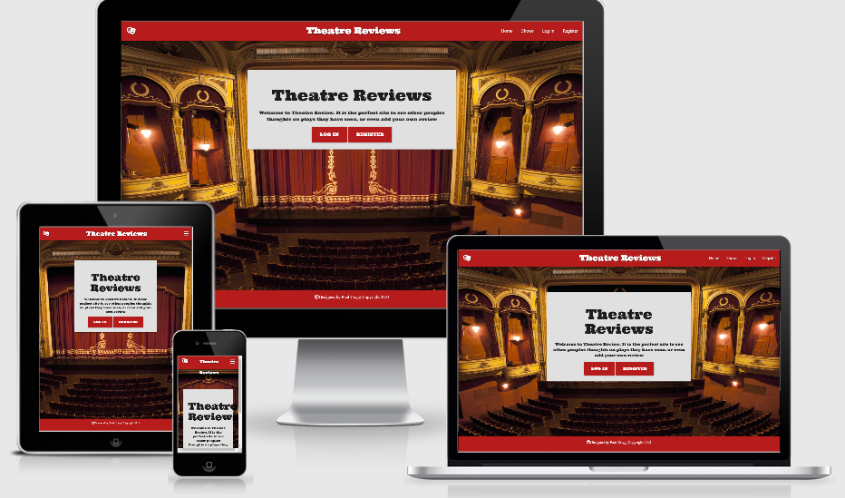

# Theatre Review

This site is for all to use. You can view shows that others have seen and see what they had to say about them. 

For a more interactive experience you can Register and add your own thoughts about your own experiences at the theatre, whether they are in London or your own local theatres.

The site allows users to Create, Read, Update and Delete any shows they have input themselves. They can also read what others have written but cannot alter them in any way.

## UX

There are so many Theatres throughout the UK that it would be impossible to search each one individually. This site would make that much easier. The search facility will help you look up a show you would like to see and check on other peoples opinions on the show. You could also look for inspiration for something new for you to see.

Visitors to the site can:

* View shows that have been added.
* Read reviews that have been written.
* Search for shows.
* Register an account for free.
* Login (if already registered).
* Logout of my account

Registered members can:

* View shows that have been added.
* Read reviews that have been written.
* Search for shows.
* Login.
* Create new shows they have seen.
* Update or Edit shows they have added.
* Delete shows they have added.

There is also an Admin Login which allows the owner to add, edit or delete genres where necessary.

## User Stories

* As a user I would want a site that is easy to use and navigate round.
* As a user I want to have an aesthetically pleasing site
* As a user I would want a free to register account.
* As a user I would want to see what shows are around.
* As a user I want to be able to register as a member.
* As a user I would like to add my own reviews.
* As a user I would want to be able to update my reviews.
* As a user I would want to be able to delete my reviews.
* As a user I would want to read other peoples reviews.

#### Developer Aims

* As a developer I want to create a visually pleasing site.
* As a developer I want to make a site that is easy to follow.
* As a developer I want to give the user the ability to Create, Read, Update and Delete their own reviews.
* Show an understanding of the Key components used in development, ie MongoDb, Heroku, Python and GitHub.
* As a developer I want the user to be encouraged to interact with the site easily.

## Wireframes

I used Balsamiq for my wireframes and showed each page as a monitor size, a tablet size and a mobile phone size. 

[Link to Wireframe](https://github.com/Craggy19/theatre_reviews/blob/master/static/images/theatre_wireframes.pdf)

## Layout

I chose the background for my site as it shows the inside of a theatre and it gve me the ideas for the colour scheme. 

The colours I used best depicted the theatre and the usual colour of the curtain in front of a stage.

I chose the typography as a warm and fun font that I found on [Google Fonts](https://fonts.google.com/)
I felt it suited the layout of the pages. I used it as the main header for the site and also on the headings of each individual page.

## Images

The Background I used is of Edinburgh Festival Theatre and the image itself was taken from Google images and the actual image came from Time Out magazine. [Background Image.](https://www.timeout.com/edinburgh/theatre/edinburgh-festivals-2015-theatre-reviews)

 # Features

 I feel that this is a straightforward site that is easy to navigate round and the features include

* A visually attractive home page with site information.
* A prompt to either Login or Register.
* Ability to read all reviews without the need to register or log in.
* Easy to register page (and it is free).
* Easy to login page.
* A page that lists all Shows that are currently in the Database. 
* Easy to read details of each show using a drop down facility.
* Search facility for all shows.
* Anyone registered can Create their own review.
* Anyone registered can Update a show they have Created.
* Anyone registered can Delete a show they have Created.
* You can only Delete or Update shows you have Created but other site visitors can read your reviews.

## Features left to Implement

* On future versions I would like to add Images of the shows reviewed, for instance the billboard image and possibly a picture of the theatre from the outside. 
* I would also like to look into the possibility of installing a location map so it will give users an idea of where shows are being performed. 
* Install a marks out of ten for each show 
* From the marks out of ten I would like to create a Top Ten Shows list.

# Technologies Used

* [HTML](https://html.com/). 
    * Used for structure of the site.
* [CSS](https://www.codecademy.com/learn/learn-css). 
    * Used for the styling of the site.
* [Python](https://www.python.org/about/apps/). 
    * Used for Backend programming.
* [JavaScript](https://www.javascript.com/). 
    * Used for functionality of the site like Modals.
* [JQuery](https://jquery.com/). 
    * Adds functionality to Materialize coding like dropdowns.
* [Balsamiq](https://balsamiq.com/). 
    * Used to build wireframes.
* [Materialize](https://materializecss.com/). 
    * Used to add front end components.
* [Font Awesome](https://fontawesome.com/). 
    * All icons used on this site are from Font Awesome.
* [Flask](https://flask.palletsprojects.com/en/1.1.x/). 
    * A microweb framework used with and written in Python.
* [MongoDb](https://www.mongodb.com/). 
    * Database where all shows, users and other info are kept.
* [PyMongo](https://pypi.org/project/pymongo/). 
    * Interacts with Mongodb with Python.
* [Werkzeug](https://pypi.org/project/Werkzeug/). 
    * Used for generating Password security.
* [Heroku](https://dashboard.heroku.com/apps).
    * Used to deploy the website.
* [Google Fonts](https://fonts.google.com/).
    * All fonts are taken from Google Fonts.
* [Google Images](https://images.google.com/imghp?hl=en&gl=ar&gws_rd=ssl).
    * Background image taken from Google Images.
* [Jinja](https://jinja.palletsprojects.com/en/2.11.x/).
    * A templating language for Python.
* [GitHub](https://github.com/).
    * Used as a repository for this site.
* [Git](https://git-scm.com/).
    * Version Control

    
            
 # Testing

